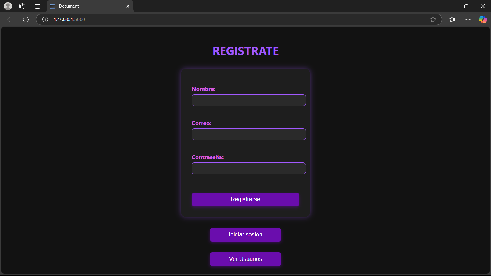
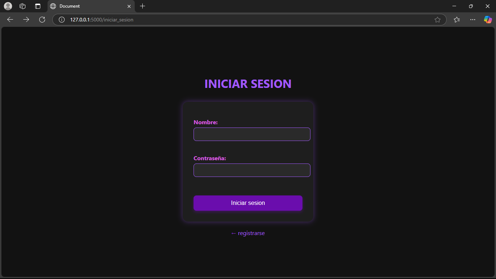
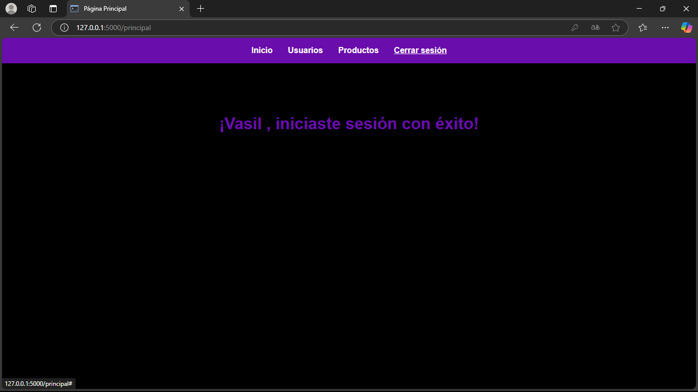

## Sistema de Registro y Login con Flask + PostgreSQL

Este proyecto es una aplicación CRUD básica construida con Flask, PostgreSQL y SQLAlchemy, que permite:
- Registrar nuevos usuarios
- Iniciar sesión
- Ver páginas protegidas solo para usuarios logueados
- Gestionar usuarios y productos (estructura básica para expandir)

- *Nota:* Actualmente, las rutas CRUD son públicas (no requieren login). Se puede modificar, eliminar o ver usuarios/productos sin estar logueado. Esta es una versión de desarrollo.

## Tecnologías utilizadas

- Python
- Flask
- PostgreSQL
- SQLAlchemy
- HTML + CSS

## Funcionalidades

- Registro de nuevos usuarios con validación
- Inicio de sesión (con sesiones de Flask)
- Navegación básica con barra de enlaces
- Rutas protegidas
- Estructura modular con carpetas separadas:
  - `app.py`
  - `models.py`
  - `config.py`
  - `templates/`
  - `static/` 

## Capturas

-Registro de usuario

-Login

-Página principal al iniciar sesión

-Lista de usuarios

## Instalación

1. Clona el repositorio:

git clone https://github.com/vasil-bit/flask-crud-login.git
cd flask-crud-login

2. Crear un entorno virtual e instalar dependencias

python -m venv venv
source venv/bin/activate  (en windows: venv/bin/activate)
pip install -r requirements.txt

3. Configurar la base de datos

Abra config.py y poné tu usuario, contraseña, y nombre de la base de datos PostgreSQL.

4. Ejecutar la aplicación

KEY="tu_contraseña" python3 app.py

## Próximas mejoras

-Proteger rutas para que solo usuarios autenticados accedan al CRUD
-Agregar roles de usuario (admin / visitante)
-Mejorar diseño visual con Bootstrap
-Agregar validaciones extra en los formularios

## Autor 
Desarrollado con dedicación por Vasil, joven programador colombiano de 16 años que va con toda por su camino freelance.

"Soy joven, pero sé lo que hago."
